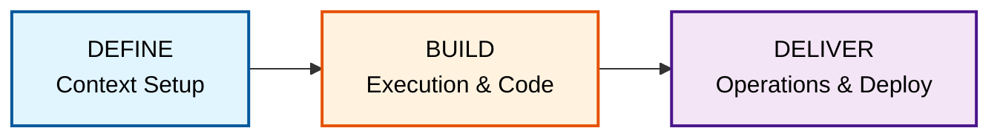
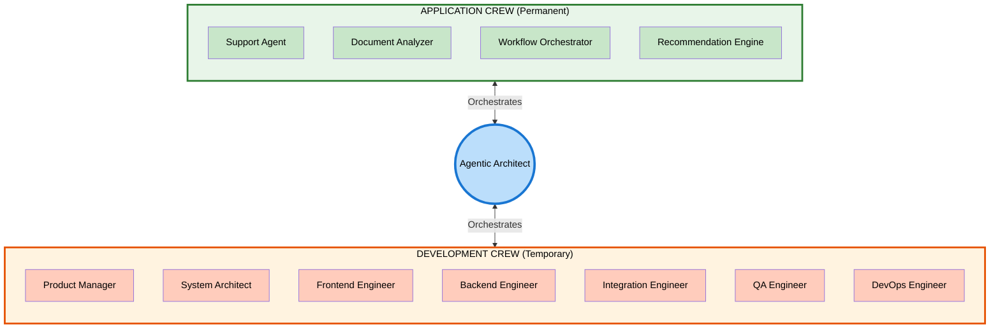

# Module 02: AAMAD Overview

**Estimated time:** ~15 minutes  
**Outcome:** Can explain AAMAD's three phases and the idea of Development Crew vs Application Crew

---

## Learning Objectives

By the end of this module, you will be able to:
- Explain the Define–Build–Deliver phases of AAMAD
- Distinguish between Development Crew and Application Crew
- Identify key artifacts produced in each phase
- Understand how Cursor rules guide agent behavior
- Recognize the role of templates in standardizing artifact creation

---

## Content

### What is AAMAD?

**AAMAD** (AI-Assisted Multi-Agent Application Development) is an open, production-grade framework for building, deploying, and evolving multi-agent applications using best context engineering practices. It systematizes research-driven planning, modular AI agent workflows, and rapid MVP/devops pipelines for enterprise-ready AI solutions.

Think of AAMAD as a **methodology and toolkit** that helps you:
- Launch projects with autonomous or collaborative AI agents
- Rapidly prototype MVPs with clear context boundaries
- Use production-ready architecture/design patterns
- Accelerate delivery, reduce manual overhead, and enable continuous iteration

AAMAD is built on the principle that **context engineering** (not model tweaking) is the core lever for building reliable, maintainable agentic systems.

### The Three Phases: Define → Build → Deliver

AAMAD organizes work into three sequential phases, each with clear artifacts, personas, and rules to keep development auditable and reusable:



#### Phase 1: Define

**Goal:** Establish a solid foundation with clear research, requirements, and project scope.

**Persona:** Product Manager (`@product-mgr`)

**Key Activities:**
- Conduct prompt-driven discovery and context setup
- Generate Market Research Document (MRD)
- Generate Product Requirements Document (PRD)
- Create comprehensive context handoff artifacts for technical teams
- Validate completeness of market analysis, user personas, feature requirements, and success metrics

**Key Artifacts:**
- `mrd.md` - Market Research Document
- `prd.md` - Product Requirements Document
- Context summary documents

**Output Location:** `project-context/1.define/`

**Why This Matters:** Without clear definition, AI agents lack the context needed to make good decisions. The Define phase ensures everyone (human and AI) understands what we're building and why.

#### Phase 2: Build

**Goal:** Execute multi-agent development to produce working code, architecture, and integration.

**Personas:** Multiple specialized agents working in sequence:
- **Project Manager** - Coordinates the build process
- **System Architect** - Designs solution architecture
- **Frontend Engineer** - Builds UI components
- **Backend Engineer** - Implements backend logic
- **Integration Engineer** - Wires up components and APIs
- **QA Engineer** - Tests end-to-end functionality

**Key Activities:**
- Generate Solution Architecture Document (SAD)
- Scaffold environment and install dependencies
- Build frontend UI and placeholders
- Implement backend services
- Wire up integrations and chat flows
- Conduct quality assurance testing

**Key Artifacts:**
- `sad.md` - Solution Architecture Document
- `setup.md` - Environment setup documentation
- `frontend.md` - Frontend implementation notes
- `backend.md` - Backend implementation notes
- `integration.md` - Integration documentation
- `qa.md` - Quality assurance test results
- Source code and configuration files

**Output Location:** `project-context/2.build/`

**Why This Matters:** The Build phase transforms requirements into working software through coordinated multi-agent execution. Each agent persona has a single responsibility, ensuring quality and maintainability.

#### Phase 3: Deliver

**Goal:** Deploy, monitor, and operate the application in production.

**Persona:** DevOps Engineer

**Key Activities:**
- Configure deployment pipelines
- Set up hosting environments
- Implement access control and security
- Create runbooks and operational documentation
- Establish monitoring and logging
- Plan for continuous deployment

**Key Artifacts:**
- Deployment configurations
- Runbooks (operational guides)
- Release notes
- Monitoring setup
- Access control policies
- QA logs and production readiness reports

**Output Location:** `project-context/3.deliver/`

**Why This Matters:** Building software is only half the battle. The Deliver phase ensures your application can run reliably in production, be monitored, and evolve over time.

### Development Crew vs Application Crew

This is a **critical distinction** in AAMAD:

#### Development Crew (The Builders)

The **Development Crew** consists of AI agent personas that **build your application**. These are the "construction workers" who create the software:

- **Product Manager** - Defines what to build
- **System Architect** - Designs how to build it
- **Frontend Engineer** - Builds user interfaces
- **Backend Engineer** - Implements business logic
- **Integration Engineer** - Connects components
- **QA Engineer** - Ensures quality
- **DevOps Engineer** - Deploys and operates

These agents are **temporary**—they exist during development to create your application. Once the project is complete, they're done.

**Example:** When building a customer service chatbot, the Development Crew includes agents like "Frontend Engineer" (who builds the chat UI) and "Backend Engineer" (who implements the conversation logic).

#### Application Crew (The Application Itself)

The **Application Crew** consists of AI agents that **are your application**. These are the agents that end users interact with in production:

- **Customer Service Agent** - Handles customer inquiries
- **Document Analyzer** - Processes and extracts information from documents
- **Recommendation Engine** - Suggests products or actions
- **Workflow Orchestrator** - Coordinates multi-step processes

These agents are **permanent**—they run in production and deliver value to end users.

**Example:** In a customer service chatbot application, the Application Crew might include:
- A "Support Agent" that answers questions
- A "Escalation Agent" that handles complex issues
- A "Feedback Collector" that gathers user satisfaction

### Visualizing the Distinction



### Core AAMAD Concepts

#### 1. Persona-Driven Development

Each workflow is owned and documented by a clear AI agent persona with a single responsibility principle. This ensures:
- Clear accountability
- Specialized expertise
- Maintainable code
- Auditable decisions

#### 2. Context Artifacts

All major actions, decisions, and documentation are stored as markdown artifacts, ensuring:
- **Explainability** - You can always understand why decisions were made
- **Reproducibility** - You can recreate the development process
- **Traceability** - You can track how requirements became code

#### 3. Parallelizable Epics

Big tasks are broken into epics, making development:
- Faster through parallel execution
- More autonomous while retaining quality control
- Easier to manage and review

#### 4. Reusability

The framework is reusable for any project. Framework artifacts (in `.cursor/`) are project-agnostic, while `project-context/` contains instance-specific documentation.

### AAMAD Repository Structure

When you use AAMAD, your project structure looks like this:

```
your-project/
├─ .cursor/                    # Reusable framework artifacts
│ ├─ agents/                   # Agent persona definitions
│ ├─ prompts/                  # Parameterized agent prompts
│ ├─ rules/                    # Architecture & workflow rules
│ └─ templates/               # Generation templates (MRD, PRD, SAD)
│
├─ project-context/            # Project-specific artifacts
│ ├─ 1.define/                 # MRD, PRD, research reports
│ ├─ 2.build/                  # SAD, code, setup docs
│ └─ 3.deliver/                # Deploy configs, runbooks, QA logs
│
└─ src/                        # Your application source code
```

**Framework artifacts** (`.cursor/`) are reusable across projects.  
**Project-context** contains all generated and instance-specific documentation.

### Cursor Rules: The Framework's Brain

AAMAD uses **Cursor rules** (stored in `.cursor/rules/`) to guide AI agent behavior and ensure consistent, high-quality output across all phases. These rules act as the "constitution" for your AI agents, defining how they should think, work, and make decisions.

#### What Are Cursor Rules?

Cursor rules are markdown files that define:
- **Architecture patterns** - How to structure code and systems
- **Workflow patterns** - How agents should coordinate and execute tasks
- **Quality standards** - What "good" looks like for code, documentation, and artifacts
- **Best practices** - Proven approaches for common scenarios

When you use CursorAI (or compatible AI coding assistants) with AAMAD, these rules are automatically loaded, ensuring all agents follow the same standards and patterns.

#### AAMAD Rule Categories

The [AAMAD framework](https://github.com/synaptic-ai-consulting/AAMAD) includes three main rule categories:

1. **Core Rules** (`core`)
   - Fundamental principles for AI-assisted development
   - Context engineering best practices
   - Artifact creation standards
   - Quality and maintainability guidelines

2. **Development Workflow Rules** (`development-workflow`)
   - How agents should execute the Build phase
   - Code organization patterns
   - Testing and integration standards
   - Documentation requirements

3. **CrewAI Adapter Rules** (`adapter-crewai`)
   - How to integrate with CrewAI framework
   - Agent orchestration patterns
   - Multi-agent coordination guidelines
   - Application Crew implementation patterns

#### How Rules Work

Rules are loaded automatically when you:
- Start a new chat session with an agent persona
- Reference an agent persona (e.g., `@system-architect`)
- Work within the AAMAD project structure

**Example:** When you invoke `@backend-engineer`, the agent automatically:
- Loads core rules (quality standards, context engineering)
- Loads development-workflow rules (code patterns, testing)
- Applies these rules to all code and documentation it creates

This ensures consistency across:
- Different chat sessions
- Different agent personas
- Different phases of development
- Different team members

### Templates: Structured Context Generation

AAMAD provides **templates** (stored in `.cursor/templates/`) that standardize artifact creation across all phases. These templates ensure consistency, completeness, and quality in all generated documentation.

#### Available Templates

The framework includes templates for each phase:

**Phase 1: Define Templates**
- **`mrd-template.md`** - Market Research Document template
  - Problem statement structure
  - Market opportunity analysis
  - Competitive landscape framework
  - Target user definition

- **`prd-template.md`** - Product Requirements Document template
  - Product overview structure
  - Feature requirements format
  - User persona templates
  - Success metrics framework
  - Application Crew definition

**Phase 2: Build Templates**
- **`sad-template.md`** - Solution Architecture Document template
  - Architecture overview structure
  - Component design format
  - Technology stack documentation
  - Integration patterns
  - Orchestration pattern selection
  - HITL (Human-in-the-Loop) gate definitions

**Phase 3: Deliver Templates**
- **`runbook-template.md`** - Operational runbook template
  - Deployment procedures
  - Monitoring setup
  - Troubleshooting guides
  - Escalation procedures

#### How Templates Work

1. **Agent Invocation**: When you invoke an agent persona (e.g., `@product-mgr`), it knows which template to use
2. **Structured Generation**: The agent uses the template to create artifacts with consistent structure
3. **Completeness Check**: Templates ensure all necessary sections are included
4. **Quality Assurance**: Standardized format makes artifacts easier to review and maintain

**Example Workflow:**
```
You: @product-mgr Please create a PRD for our customer service chatbot

Agent: 
1. Loads prd-template.md
2. Fills in each section based on your requirements
3. Creates project-context/1.define/prd.md
4. Ensures all required sections are complete
```

#### Benefits of Templates

- **Consistency** - All PRDs, SADs, and runbooks follow the same structure
- **Completeness** - Templates ensure nothing is missed
- **Reusability** - Templates work across all projects
- **Maintainability** - Standard structure makes updates easier
- **Onboarding** - New team members understand the format immediately

### Agents and Prompts: Persona Definitions

The `.cursor/agents/` and `.cursor/prompts/` folders complete the framework:

**Agents** (`.cursor/agents/`)
- Define each agent persona's role, responsibilities, and expertise
- Specify which templates and rules each persona uses
- Establish persona-specific workflows

**Prompts** (`.cursor/prompts/`)
- Parameterized prompts for common tasks
- Phase-specific prompt templates
- Context loading instructions

Together, rules, templates, agents, and prompts create a complete system for consistent, high-quality AI-assisted development.

### Why AAMAD Works

AAMAD addresses common problems in AI-assisted development:

1. **Context Chaos** - Without structure, AI agents lack context. AAMAD provides clear context boundaries.

2. **Quality Debt** - Rapid AI coding often produces "slop." AAMAD's persona-driven approach ensures quality.

3. **Maintenance Nightmares** - Unstructured AI-generated code is hard to maintain. AAMAD's artifact-driven approach ensures traceability.

4. **Lack of Reusability** - Each project starts from scratch. AAMAD's framework artifacts are reusable.

5. **No Clear Process** - Teams don't know how to systematically build agentic systems. AAMAD provides a proven methodology.

### Getting Started with AAMAD

AAMAD can be used in two ways:

1. **Clone the Repository**
   ```bash
   git clone https://github.com/synaptic-ai-consulting/AAMAD
   ```

2. **Install via pip/uv**
   ```bash
   pip install aamad
   aamad init --dest /path/to/your/project
   ```

Once set up, you follow the three-phase process, using the Development Crew to build your Application Crew.

---

## Check Your Understanding

Reflect on these questions to solidify your understanding:

For each scenario below, identify which AAMAD phase it belongs to:
- Writing a Product Requirements Document
- Deploying an application to production
- Writing unit tests for a feature
- Creating a runbook for operations
- Designing the system architecture

1. **Crew Distinction**: Imagine you're building a document processing system. 
   - What would be in your **Application Crew**? (What agents will users interact with?)
   - What would be in your **Development Crew**? (What agents will build the system?)

2. **Artifact Traceability**: Why is it important that AAMAD stores all decisions as markdown artifacts? How does this help with maintenance and debugging?

3. **Persona Benefits**: How does the persona-driven approach (single responsibility per agent) help prevent the "slop" problem in AI-assisted development?

4. **Phase Dependencies**: Why must the phases run in order (Define → Build → Deliver)? What would happen if you tried to Build without Define, or Deliver without Build?

**Scenario: Cursor Rules and Templates**

You're starting a new project using AAMAD. You need to set up Cursor rules and understand how templates work with agent personas.

5. How do Cursor rules ensure consistency across different agent personas and chat sessions?

6. What's the difference between a template (like `prd-template.md`) and the actual artifact (like `prd.md`)? Why are templates important for maintaining quality in AI-generated artifacts?

---

## Next Steps

Continue to [Module 03: Context Engineering Basics](./03-context-engineering-basics.md)

