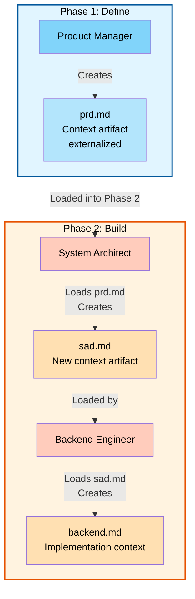

# Module 03: Context Engineering Basics

**Estimated time:** ~15 minutes  
**Outcome:** Internalize context engineering as the core lever, not model tweaking

---

## Learning Objectives

By the end of this module, you will be able to:
- Explain the "dumb zone" concept
- Apply context engineering techniques: writing, selecting, compressing, isolating
- Write context-engineered prompts vs basic prompts

---

## Content

### The Core Problem: Context Window Limitations

When working with AI assistants, you've likely experienced this: the AI seems to "forget" earlier parts of the conversation, makes decisions without proper context, or produces inconsistent results. This isn't a bug—it's a fundamental limitation of how AI models work.

Every AI model has a **context window**—the maximum amount of text it can process at once. When you exceed this limit, the model loses information. But even before hitting the limit, there's a more subtle problem: **context quality degrades as the conversation grows**.

### The Dumb Zone vs The Smart Zone

Dex Horthy introduced a critical concept in his talk on efficient AI-assisted development: the **"dumb zone"** and the **"smart zone"**.

#### The Dumb Zone

The **dumb zone** occurs when:
- Context is scattered across a long conversation thread
- Critical information is buried in chat history
- The AI lacks access to structured, relevant context
- You're working within a single chat session with limited context visibility
- Context must be re-explained or re-discovered in each interaction

**Symptoms of working in the dumb zone:**
- AI asks questions you've already answered
- Inconsistent decisions across different parts of the project
- Need to repeatedly explain the same concepts
- Difficulty maintaining context across multiple chat sessions
- AI makes decisions without full project context

#### The Smart Zone

The **smart zone** occurs when:
- Context is **externalized** into structured artifacts (markdown files)
- Relevant context can be **selected and loaded** as needed
- Context is **isolated** by concern (architecture, requirements, implementation)
- Context is **compressed** into essential information
- Multiple agents can work **asynchronously** with shared context

**Benefits of working in the smart zone:**
- Consistent decisions across the entire project
- No need to re-explain context
- Multiple chat sessions can access the same context
- Different agent personas can work in parallel
- Context is versioned, auditable, and reusable

### Context Engineering: The Four Techniques

Context engineering is the practice of managing context to maximize AI effectiveness. There are four core techniques:

#### 1. Writing Context

**What it is:** Creating structured, comprehensive context documents that capture decisions, requirements, and knowledge.

**How AAMAD does it:**
- **Markdown artifacts** for every major decision and phase
- **Templates** ensure consistent structure (MRD, PRD, SAD, runbooks)
- **Versioned artifacts** in `project-context/` folders
- **Clear documentation** of why decisions were made

**Example:** Instead of explaining requirements in chat, AAMAD creates a `prd.md` file that contains all requirements, user personas, and success metrics.

#### 2. Selecting Context

**What it is:** Loading only the relevant context needed for a specific task, rather than everything.

**How AAMAD does it:**
- **Phase-specific folders** (`1.define/`, `2.build/`, `3.deliver/`)
- **Artifact-specific files** (need architecture? Load `sad.md`. Need requirements? Load `prd.md`)
- **Selective loading** into new chat sessions as needed
- **No context bloat** from irrelevant information

**Example:** When working with the Backend Engineer persona, you load `sad.md` and `backend.md`—not the frontend documentation or deployment configs.

#### 3. Compressing Context

**What it is:** Distilling context into essential information, removing redundancy and noise.

**How AAMAD does it:**
- **Structured templates** force concise, essential information
- **Summary documents** capture key decisions without full conversation history
- **Focused artifacts** contain only what's needed for that concern
- **No duplication** across artifacts

**Example:** The `sad.md` contains architecture decisions and patterns, not the full conversation about why each decision was made—that's compressed into the essential "what" and "why."

#### 4. Isolating Context

**What it is:** Separating concerns so each context artifact has a single, clear purpose.

**How AAMAD does it:**
- **Separate artifacts** for different concerns (requirements vs architecture vs deployment)
- **Persona-specific context** (each agent persona has its own context needs)
- **Phase isolation** (Define artifacts don't mix with Build artifacts)
- **Clear boundaries** between concerns

**Example:** `prd.md` contains requirements only. `sad.md` contains architecture only. `runbook.md` contains operations only. They don't mix concerns.

### How AAMAD Stays in the Smart Zone

AAMAD is specifically designed to keep you in the smart zone throughout the entire development lifecycle:

#### 1. Context Externalization

**Problem:** Traditional AI-assisted development keeps context in chat history.

**AAMAD Solution:** All context is externalized into markdown artifacts:
```
project-context/
├─ 1.define/
│  ├─ mrd.md          # Market research context
│  └─ prd.md          # Requirements context
├─ 2.build/
│  ├─ sad.md          # Architecture context
│  ├─ frontend.md     # Frontend context
│  └─ backend.md      # Backend context
└─ 3.deliver/
   └─ runbook.md      # Operations context
```

**Benefit:** Context is persistent, versioned, and accessible outside of chat sessions.

#### 2. Asynchronous Multi-Persona Work

**Problem:** Working with multiple AI agents in a single chat session creates context chaos.

**AAMAD Solution:** Each agent persona works with its own context artifacts:
- **Product Manager** works with `mrd.md` and `prd.md`
- **System Architect** works with `prd.md` and creates `sad.md`
- **Backend Engineer** works with `sad.md` and creates `backend.md`
- **DevOps Engineer** works with deployment artifacts and creates `runbook.md`

**Benefit:** Agents can work in parallel, in different chat sessions, without context conflicts.

#### 3. Context Loading on Demand

**Problem:** Loading all context into every chat session wastes tokens and confuses the AI.

**AAMAD Solution:** Load only relevant context for the task:
```markdown
# When working with Backend Engineer persona:
- Load: project-context/2.build/sad.md
- Load: project-context/2.build/backend.md
- Don't load: frontend.md, runbook.md, mrd.md
```

**Benefit:** Focused context leads to better AI decisions and lower token costs.

#### 4. Cross-Session Context Continuity

**Problem:** Starting a new chat session means losing all context from previous sessions.

**AAMAD Solution:** Load relevant artifacts into new sessions:
```markdown
# New chat session with System Architect
@system-architect

Please review the requirements in project-context/1.define/prd.md 
and create the solution architecture document.
```

**Benefit:** Context persists across sessions, enabling long-term project continuity.

#### 5. Versioned Context History

**Problem:** Context changes over time, but there's no record of what changed or why.

**AAMAD Solution:** All artifacts are versioned in git:
- See how requirements evolved
- Track architecture decision changes
- Understand why decisions were made
- Roll back if needed

**Benefit:** Full audit trail and ability to understand project evolution.

### The AAMAD Context Flow

Here's how context flows through an AAMAD project:



Each phase builds on previous context artifacts, but agents only load what they need.

### Bad Prompt vs Context-Engineered Prompt

Let's see the difference with a concrete example:

#### ❌ Bad Prompt (Dumb Zone)

```
"Create a user authentication system for my app. 
It should handle login, registration, and password reset. 
Make it secure. Use Python and Flask. 
Oh, and remember we discussed using JWT tokens earlier 
in this conversation (scroll up to see)."
```

**Problems:**
- No structured context
- Relies on chat history
- Vague requirements
- No architecture context
- Can't be reused in new session

#### ✅ Context-Engineered Prompt (Smart Zone)

```
@backend-engineer

Please implement the authentication system based on:

1. Requirements: project-context/1.define/prd.md (see Section 3.2: Authentication)
2. Architecture: project-context/2.build/sad.md (see Section 4: Security Architecture)
3. Existing code: src/auth/models.py (user model already defined)

Requirements:
- JWT-based authentication
- Password hashing with bcrypt
- Rate limiting on login attempts (5 per minute)
- Email verification for registration

Follow the patterns established in project-context/2.build/backend.md
```

**Benefits:**
- References structured context artifacts
- Loads only relevant context
- Clear, specific requirements
- Architecture context included
- Reusable in any chat session
- Follows established patterns

### Context Engineering Best Practices

When using AAMAD (or any AI-assisted development), follow these practices:

1. **Always Externalize Context**
   - Don't rely on chat history
   - Create markdown artifacts for decisions
   - Use AAMAD templates for structure

2. **Select Context Carefully**
   - Load only what's needed for the task
   - Don't load entire project context
   - Use phase-specific and persona-specific context

3. **Compress Context**
   - Summarize decisions, don't include full conversations
   - Focus on "what" and "why," not "how we discussed it"
   - Remove redundancy

4. **Isolate Concerns**
   - One artifact = one concern
   - Don't mix requirements with architecture
   - Keep deployment separate from implementation

5. **Version Everything**
   - Commit artifacts to git
   - Track changes over time
   - Enable rollback if needed

---

## Exercise

### Exercise: Transform a Dumb Zone Prompt into a Smart Zone Prompt

**Scenario:** You're building a customer support chatbot. You've been chatting with an AI assistant about the requirements, and now you want to implement the conversation flow logic.

#### Step 1: Identify the Dumb Zone Prompt

Here's what you might say in a traditional approach:

```
"Hey, remember we talked about the customer support bot? 
I need you to implement the conversation flow. 
It should handle greetings, collect user info, 
route to the right department based on the issue type 
we discussed (you know, technical vs billing vs general), 
and escalate if needed. Use the patterns we established 
earlier in this chat."
```

**Problems to identify:**
- [ ] Relies on chat history
- [ ] Vague references to "we discussed"
- [ ] No structured context
- [ ] Can't be used in new session

#### Step 2: Create Context Artifacts

First, create the necessary context artifacts:

**File: `project-context/1.define/prd.md`**
```markdown
## 3. Core Features

### 3.1 Conversation Flow
- Greeting: Welcome user, ask how we can help
- Information Collection: Name, email, issue category
- Routing: 
  - Technical issues → Technical Support
  - Billing issues → Billing Department  
  - General inquiries → General Support
- Escalation: If issue unresolved after 3 exchanges → Human agent
```

**File: `project-context/2.build/sad.md`**
```markdown
## 4. Conversation Architecture

### 4.1 Flow Pattern
- State machine pattern for conversation states
- Context preservation across turns
- Intent classification for routing
```

#### Step 3: Write the Smart Zone Prompt

Now rewrite the prompt using context engineering:

```
@backend-engineer

Please implement the conversation flow system based on:

1. Requirements: project-context/1.define/prd.md (Section 3.1: Conversation Flow)
2. Architecture: project-context/2.build/sad.md (Section 4.1: Flow Pattern)

Implementation requirements:
- State machine for conversation states (greeting → collect_info → route → resolve/escalate)
- Intent classification to route to: Technical Support, Billing Department, or General Support
- Escalation trigger: After 3 unresolved exchanges, transfer to human agent
- Context preservation: Maintain conversation history within session

Use Python with a state machine library. Follow the patterns in 
project-context/2.build/backend.md for error handling and logging.
```

#### Step 4: Compare and Reflect

**What changed?**
- ✅ References structured artifacts instead of chat history
- ✅ Specific, actionable requirements
- ✅ Architecture context included
- ✅ Reusable in any chat session
- ✅ Follows established patterns

**Try it yourself:** Take a prompt you've used recently and transform it using context engineering principles. Create the necessary context artifacts first, then rewrite the prompt.

---

## Check Your Understanding

Reflect on these questions to solidify your understanding:

1. **Dumb Zone Symptoms**: Think of a recent AI-assisted development session. Did you experience any "dumb zone" symptoms? What were they, and how could context engineering have helped?

2. **Context Selection**: You're working with the Frontend Engineer persona to build a React component. Which AAMAD artifacts should you load? Which should you avoid loading? Why?

3. **Asynchronous Work**: How does AAMAD's artifact-based approach enable multiple agent personas to work simultaneously on different parts of the project? What would happen if they all worked in the same chat session?

4. **Context Compression**: You have a 50-message chat history discussing architecture decisions. How would you compress this into a `sad.md` artifact? What information is essential? What can be omitted?

5. **Cross-Session Continuity**: You start a new chat session three weeks after your last one. How do AAMAD artifacts enable you to continue where you left off? What would happen without them?

6. **The Four Techniques**: For each context engineering technique (writing, selecting, compressing, isolating), give a concrete example of how AAMAD implements it. How do these techniques work together?

7. **Smart Zone Benefits**: List three specific benefits of working in the smart zone that directly impact your productivity and code quality. How do these benefits compound over a full project lifecycle?

---

## Next Steps

Continue to [Module 04: Introduction to Building Multi-Agent AI Systems with CrewAI](./04-building-your-multiagent-application-crew.md)

