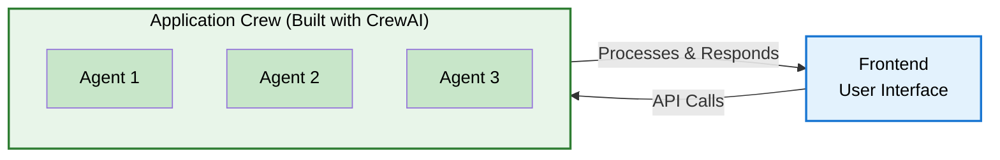
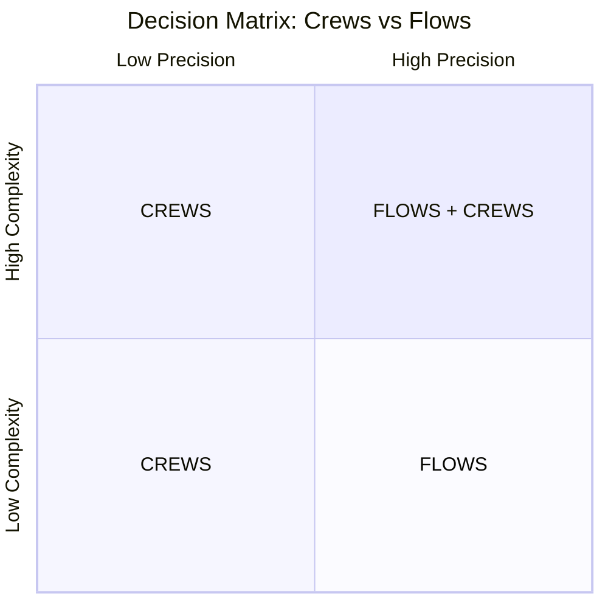
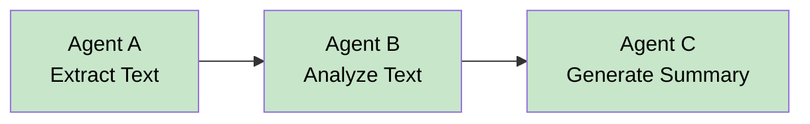
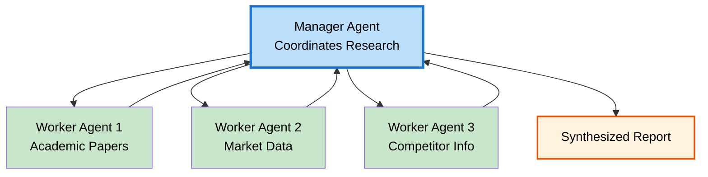
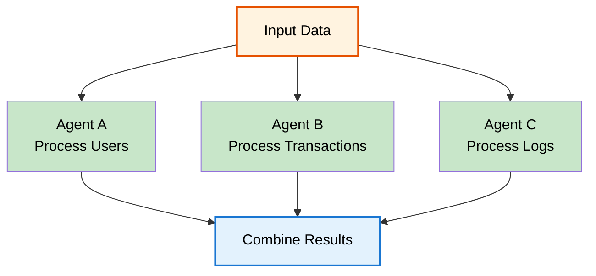

# Module 04: Introduction to Building Multi-Agent AI Systems with CrewAI

**Estimated time:** ~15 minutes  
**Outcome:** Understand how to build Application Crews using CrewAI framework

---

## Learning Objectives

By the end of this module, you will be able to:
- Understand the fundamental components of CrewAI: agents, tasks, and tools
- Distinguish between CrewAI Flows and CrewAI Crews and know when to use each
- Recognize different orchestration patterns supported by CrewAI
- Design an Application Crew as the backend intelligence of your agentic application

---

## Content

### What is CrewAI?

**CrewAI** is an open-source framework designed to orchestrate role-playing, autonomous AI agents. It enables developers to create sophisticated multi-agent systems where specialized agents collaborate to accomplish complex tasks. CrewAI is the **default framework** used in the AAMAD method for building Application Crews—the core intelligence that powers your agentic applications.

Think of CrewAI as the "operating system" for your Application Crew. Just as an operating system manages processes and resources, CrewAI manages agents, tasks, and their interactions.

### The Application Crew: Your Backend Intelligence

Before diving into CrewAI specifics, let's clarify the **Application Crew's role** in your architecture:



The **Application Crew** is the backend intelligence of your agentic application. It:
- Receives requests from your frontend (web UI, mobile app, API, etc.)
- Processes inputs using specialized AI agents
- Coordinates agent collaboration to complete complex tasks
- Returns intelligent responses to the frontend

**During the AAMAD Build phase**, you'll design and implement this Application Crew using CrewAI, while your Development Crew (the temporary AI agents that build your application) creates both the frontend and the Application Crew backend.

### Core CrewAI Concepts

CrewAI is built on three fundamental components:

#### 1. Agents

An **agent** is an autonomous AI entity with a specific role, goal, and capabilities. Each agent is designed to excel at particular tasks.

**Key Agent Properties:**
- **Role**: The agent's function (e.g., "Customer Support Specialist", "Document Analyzer", "Recommendation Engine")
- **Goal**: What the agent aims to accomplish
- **Backstory**: Context that shapes the agent's behavior and decision-making
- **Tools**: Capabilities the agent can use (APIs, databases, functions)
- **LLM**: The language model powering the agent (OpenAI, Anthropic, etc.)

**Example:**
```python
from crewai import Agent

support_agent = Agent(
    role="Customer Support Specialist",
    goal="Resolve customer inquiries quickly and accurately",
    backstory="You are an experienced customer service professional with deep knowledge of our products and services.",
    tools=[search_knowledge_base, create_ticket],
    verbose=True
)
```

#### 2. Tasks

A **task** is a unit of work assigned to an agent. Tasks define what needs to be accomplished, including:
- **Description**: What the task involves
- **Agent**: Which agent should perform the task
- **Expected Output**: What the task should produce
- **Dependencies**: Other tasks that must complete first

**Example:**
```python
from crewai import Task

analyze_inquiry = Task(
    description="Analyze the customer's inquiry and identify the core issue",
    agent=support_agent,
    expected_output="A structured analysis of the customer's problem with key details identified"
)
```

#### 3. Tools

**Tools** are functionalities that agents use to perform their tasks. Tools extend agent capabilities beyond language model responses.

**Common Tool Types:**
- **API Integrations**: Connect to external services (databases, search engines, payment processors)
- **Custom Functions**: Python functions that perform specific operations
- **Data Processing**: Tools for reading, writing, or transforming data
- **Web Search**: Tools for retrieving real-time information

**Example:**
```python
from crewai_tools import SerperDevTool

search_tool = SerperDevTool()
agent = Agent(
    role="Researcher",
    tools=[search_tool]  # Agent can now search the web
)
```

### CrewAI Flows vs CrewAI Crews

CrewAI provides two primary orchestration mechanisms. Understanding when to use each is crucial for designing effective Application Crews.

#### CrewAI Crews

A **Crew** is a team of agents that work together to accomplish a shared goal. Crews are ideal when:

- **Collaborative Problem-Solving**: Multiple agents need to work together, potentially sharing information and building on each other's work
- **Complex Workflows**: Tasks have dependencies and require coordination
- **Role-Based Specialization**: Different agents handle different aspects of a problem

**Crew Characteristics:**
- Agents can collaborate and share context
- Tasks can be sequential or have dependencies
- Supports manager-worker patterns (hierarchical)
- Agents can review or refine each other's work

**Use Cases:**
- Customer support system where one agent analyzes the issue, another searches knowledge base, and a third formulates the response
- Document processing where one agent extracts data, another validates it, and a third formats the output
- Research workflows where agents gather information, analyze it, and synthesize findings

#### CrewAI Flows

A **Flow** is a more structured, sequential workflow where agents execute tasks in a predefined order. Flows are ideal when:

- **Linear Processes**: Tasks must execute in a specific sequence
- **Simple Orchestration**: Straightforward workflows without complex branching
- **Performance Optimization**: You need predictable execution patterns

**Flow Characteristics:**
- Tasks execute in a fixed order
- Less dynamic collaboration between agents
- More predictable execution paths
- Easier to debug and monitor

**Use Cases:**
- Simple data processing pipelines
- Sequential approval workflows
- Step-by-step form filling or data collection
- Linear transformation processes

#### Decision Framework: Crews vs Flows

Use this **Decision Matrix** to choose between Crews and Flows based on two dimensions: **Complexity** and **Precision**.

**The Decision Matrix:**



**Step 1: Assess Precision** (Rate each 1-10, then average)

1. **Output structure**: Free-form text (1-3) → Semi-structured (4-7) → Strictly formatted/JSON (8-10)
2. **Accuracy needs**: Creative content (1-3) → Informational (4-7) → Critical information (8-10)
3. **Reproducibility**: Variation acceptable (1-3) → Some consistency (4-7) → Exact reproducibility (8-10)
4. **Error tolerance**: Low impact (1-3) → Moderate impact (4-7) → High impact (8-10)

**Step 2: Assess Complexity** (Rate each 1-10, then average)

1. **Number of steps**: 1-3 steps (1-3) → 4-7 steps (4-7) → 8+ steps (8-10)
2. **Interdependencies**: Few dependencies (1-3) → Some dependencies (4-7) → Many complex dependencies (8-10)
3. **Conditional logic**: Linear process (1-3) → Some branching (4-7) → Complex decision trees (8-10)
4. **Domain knowledge**: General knowledge (1-3) → Some specialized (4-7) → Deep expertise multiple domains (8-10)

**Decision Rules:**

- **High Complexity** → Always need **CREWS** (alone or with FLOWS)
- **High Precision** → Always need **FLOWS** (alone or with CREWS)
- **Low Complexity + Low Precision** → Use **CREWS**
- **Low Complexity + High Precision** → Use **FLOWS**
- **High Complexity + High Precision** → Use **FLOWS + CREWS**

**Quick Reference:**

| Complexity | Precision | Recommendation |
|------------|-----------|---------------|
| Low | Low | CREWS |
| Low | High | FLOWS |
| High | Low | CREWS |
| High | High | FLOWS + CREWS |

### Orchestration Patterns in CrewAI

CrewAI supports several orchestration patterns that determine how agents coordinate and execute tasks. Understanding these patterns helps you design efficient Application Crews.

#### 1. Sequential Pattern

Tasks execute one after another in a fixed order. Each task waits for the previous one to complete.

**Characteristics:**
- Simple and predictable
- Easy to debug
- Lower parallelism
- Suitable for dependent tasks

**Example Use Case:**
A document processing system where:
1. Agent A extracts text from a document
2. Agent B analyzes the extracted text
3. Agent C generates a summary



#### 2. Hierarchical (Manager-Worker) Pattern

A manager agent delegates tasks to worker agents and coordinates their outputs.

**Characteristics:**
- Centralized coordination
- Dynamic task assignment
- Manager reviews and synthesizes worker outputs
- Suitable for complex, multi-faceted problems

**Example Use Case:**
A research assistant where:
- Manager Agent coordinates the research
- Worker Agent 1 searches for academic papers
- Worker Agent 2 analyzes market data
- Worker Agent 3 reviews competitor information
- Manager Agent synthesizes all findings



#### 3. Consensual (Planned) Pattern

Agents collaborate democratically to plan and execute tasks, often involving discussion and consensus-building.

**Characteristics:**
- Agents can discuss and refine approaches
- Collaborative decision-making
- More complex but potentially higher quality
- Suitable for creative or ambiguous problems

**Example Use Case:**
A content creation system where multiple agents discuss and refine a marketing campaign strategy before execution.

#### 4. Concurrent Pattern

Multiple agents work on independent tasks simultaneously.

**Characteristics:**
- High parallelism
- Faster overall execution
- Tasks must be independent
- Suitable for parallelizable work

**Example Use Case:**
A data processing system where:
- Agent A processes user data
- Agent B processes transaction data
- Agent C processes log data
- All run simultaneously, then results are combined



### Building Your Application Crew: A Practical Example

Let's walk through designing an Application Crew for a customer support chatbot:

**Step 1: Define Your Agents**
- **Support Agent**: Handles initial customer inquiries
- **Knowledge Base Agent**: Searches documentation and FAQs
- **Escalation Agent**: Handles complex issues requiring human review

**Step 2: Define Tasks**
- Task 1: Analyze customer inquiry (Support Agent)
- Task 2: Search knowledge base (Knowledge Base Agent)
- Task 3: Formulate response (Support Agent)
- Task 4: Escalate if needed (Escalation Agent)

**Step 3: Choose Orchestration Pattern**
- Use a **Crew** with **Sequential + Hierarchical** pattern:
  - Support Agent acts as coordinator
  - Knowledge Base Agent works in parallel when needed
  - Escalation Agent intervenes when confidence is low

**Step 4: Integrate with Frontend**
- Frontend sends user message via API
- Application Crew processes the message
- Response is returned to frontend for display

### The AAMAD Build Phase Connection

During the **AAMAD Build phase**, your Development Crew will:

1. **Design the Application Crew Architecture** (System Architect persona)
   - Define agents, tasks, and orchestration patterns
   - Document in Solution Architecture Document (SAD)

2. **Implement the Application Crew** (Backend Engineer persona)
   - Write CrewAI code to instantiate agents
   - Configure tasks and tools
   - Set up orchestration logic

3. **Build the Frontend** (Frontend Engineer persona)
   - Create UI that connects to Application Crew API
   - Design user interactions

4. **Integrate Components** (Integration Engineer persona)
   - Wire frontend to Application Crew backend
   - Set up API endpoints and communication

The Application Crew you build with CrewAI becomes the **permanent intelligence** running in production, while the Development Crew that built it is **temporary** and completes once the application is delivered.

---

## Check Your Understanding

Take a moment to reflect on these questions:

1. **Core Components**: What are the three fundamental components of CrewAI, and how do they work together to create a multi-agent system?

2. **Crews vs Flows**: Imagine you're building a document analysis system. Would you use a Crew or a Flow? Why?

3. **Orchestration Patterns**: You're designing a recommendation system that needs to:
   - Analyze user preferences (Agent A)
   - Search product catalog (Agent B)
   - Generate personalized recommendations (Agent C)
   
   Which orchestration pattern would you choose? Why?

4. **Application Crew Role**: How does the Application Crew differ from the Development Crew in the AAMAD framework? Where does each run, and what is their purpose?

5. **Architecture Design**: Think of a simple application you'd like to build. What agents would make up your Application Crew? What tasks would each agent handle? Which orchestration pattern would you use?

---

## Next Steps

- **Explore CrewAI Documentation**: Visit [docs.crewai.com](https://docs.crewai.com) to dive deeper into agents, tasks, tools, and advanced features
- **Review Examples**: Check out the [CrewAI examples repository](https://github.com/crewAIInc/crewAI-examples) to see real-world implementations
- **Practice**: Try designing an Application Crew for a simple use case (e.g., a personal assistant, a research helper, or a content generator)

Continue to [Module 05: Hands-On Mini-Project - Define](./05-hands-on-mini-project-define.md) where you'll define your own Application Crew for the mini-project.
